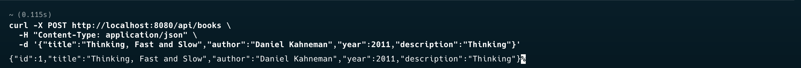
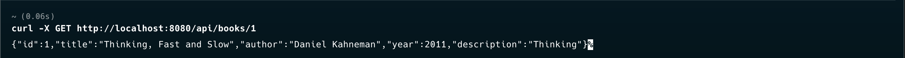
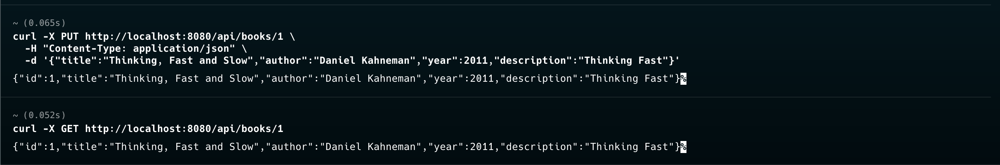
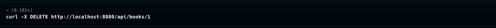

# Books API

REST API для управления библиотекой книг, разработанное на Spring Boot.

## Технологии

- **Java 21**
- **Spring Boot 3.5.7**
- **Spring Data JPA**
- **H2 Database** (in-memory)
- **Maven**

## Сборка и запуск

### Сборка приложения
```bash
mvn clean compile
```

### Запуск приложения
```bash
mvn spring-boot:run
```

### Создание JAR файла
```bash
mvn clean package
```

### Запуск JAR файла
```bash
java -jar target/books-0.0.1-SNAPSHOT.jar
```

Приложение будет доступно по адресу: `http://localhost:8080`

## API Endpoints

### 1. Получить все книги

**GET** `/api/books`

```bash
curl -X GET http://localhost:8080/api/books
```


### 2. Создать новую книгу

**POST** `/api/books`

```bash
curl -X POST http://localhost:8080/api/books \
  -H "Content-Type: application/json" \
  -d '{"title":"Thinking, Fast and Slow","author":"Daniel Kahneman","year":2011,"description":"Thinking"}'
```



### 3. Получить книгу по ID

**GET** `/api/books/{id}`

```bash
curl -X GET http://localhost:8080/api/books/1
```



### 4. Обновить книгу

**PUT** `/api/books/{id}`

```bash
curl -X PUT http://localhost:8080/api/books/1 \
  -H "Content-Type: application/json" \
  -d '{"title":"Thinking, Fast and Slow","author":"Daniel Kahneman","year":2011,"description":"Thinking Fast"}'
```



### 5. Удалить книгу

**DELETE** `/api/books/{id}`

```bash
curl -X DELETE http://localhost:8080/api/books/1
```



## База данных

Приложение использует встроенную базу данных H2. Консоль H2 доступна по адресу:
- URL: `http://localhost:8080/h2-console`
- JDBC URL: `jdbc:h2:mem:testdb`
- Username: `sa`
- Password: (оставить пустым)

## Требования

- Java 21 или выше
- Maven 3.6 или выше